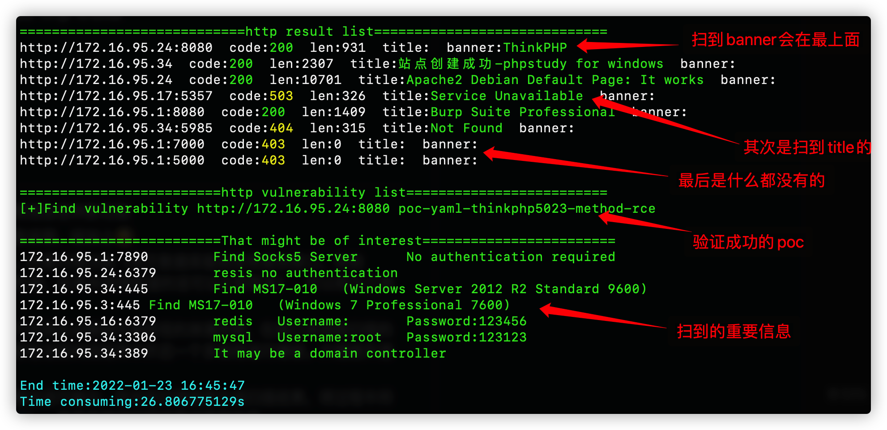
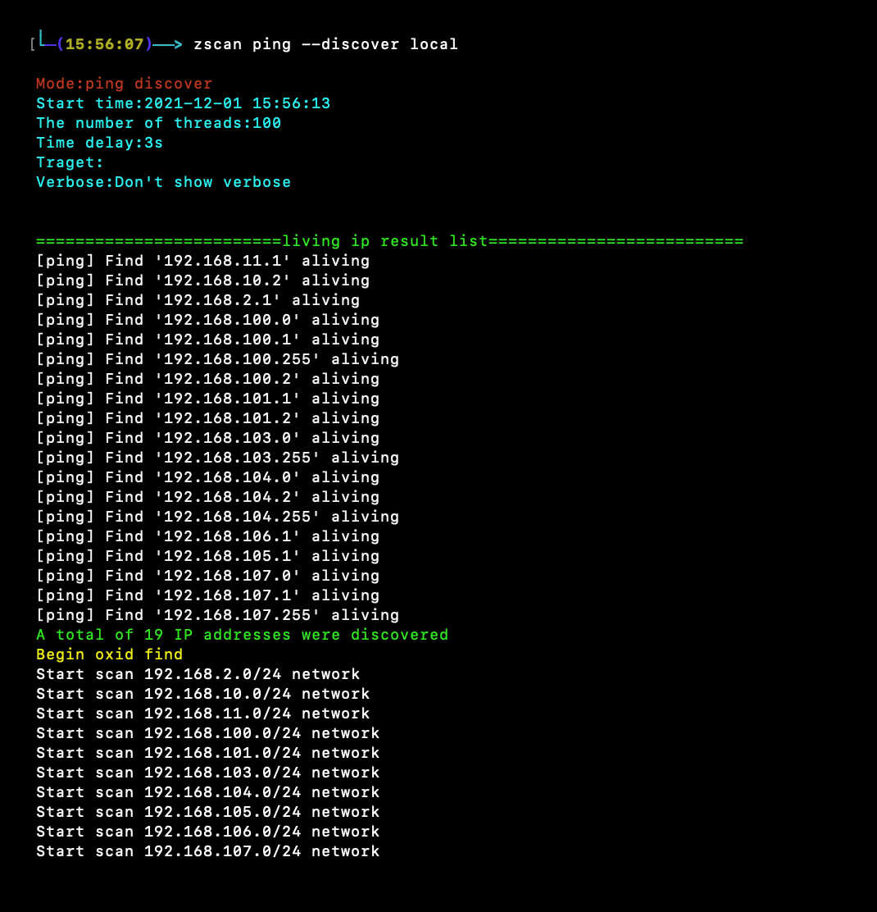
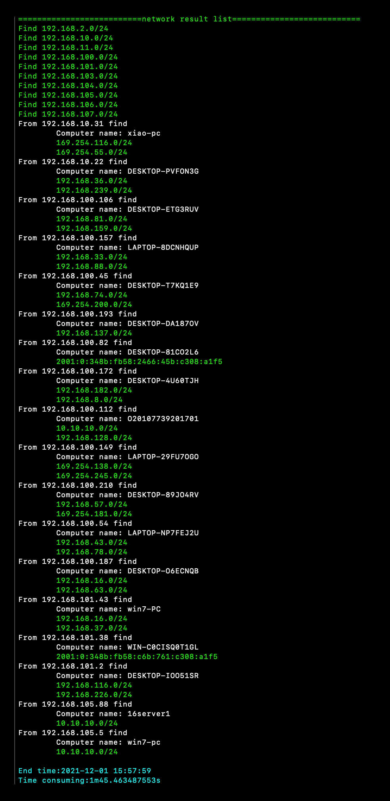
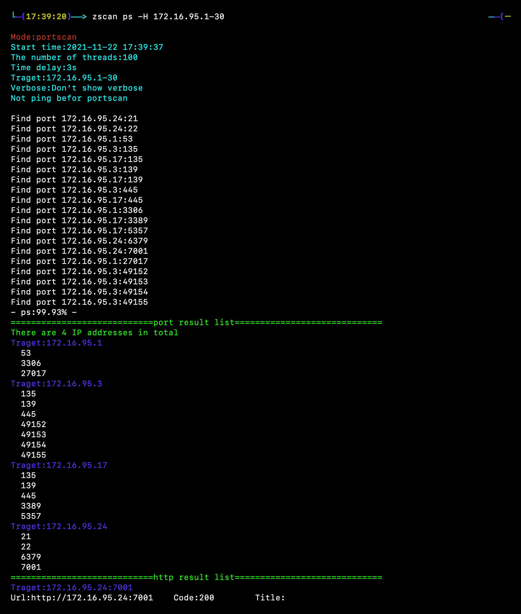
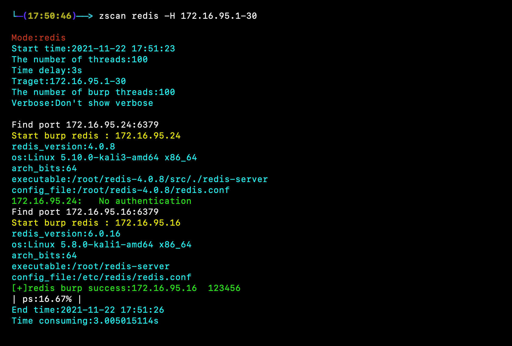
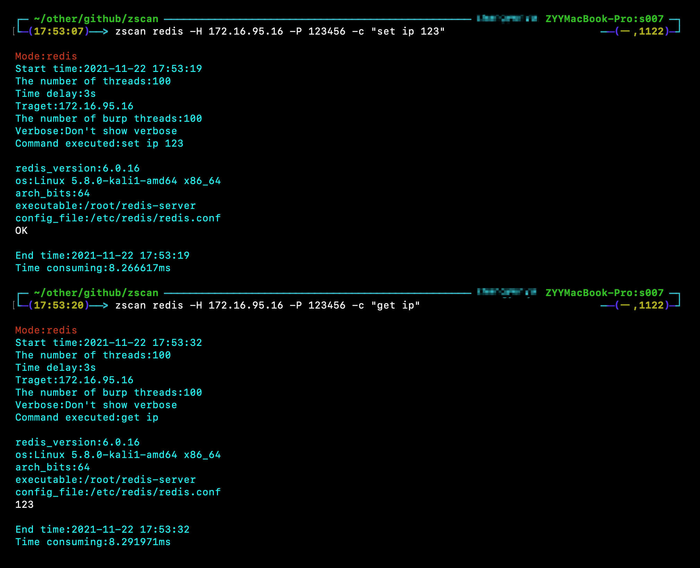
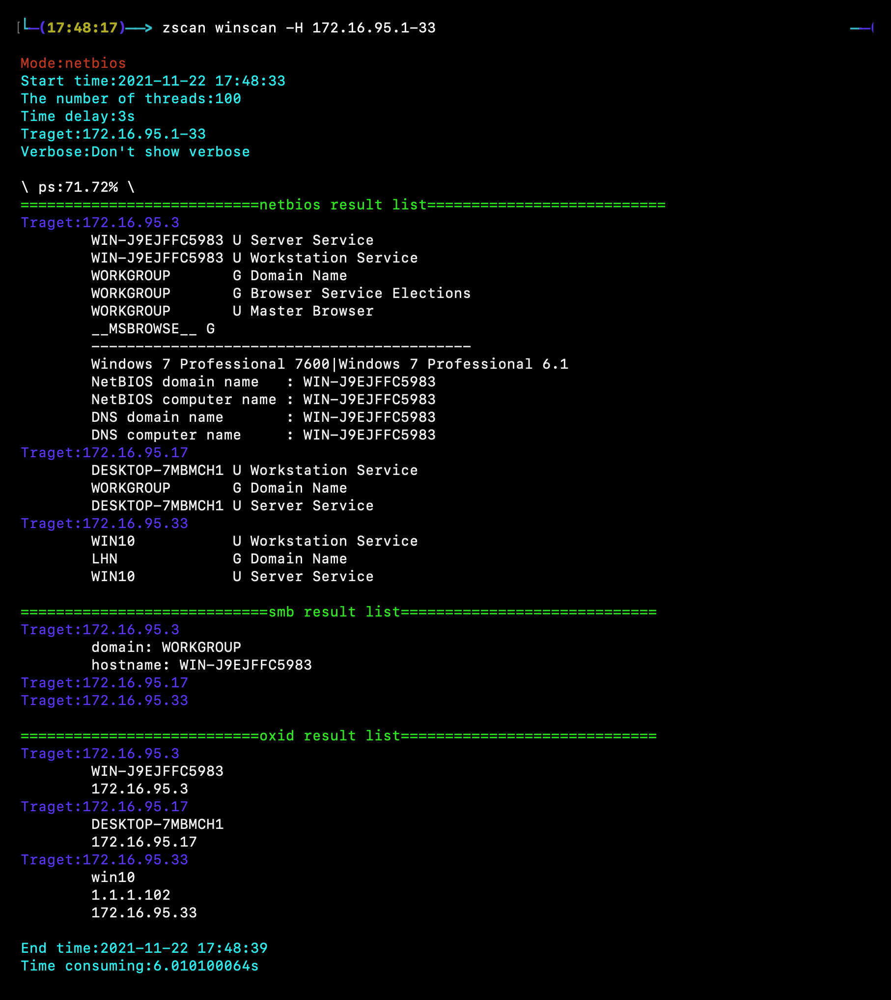
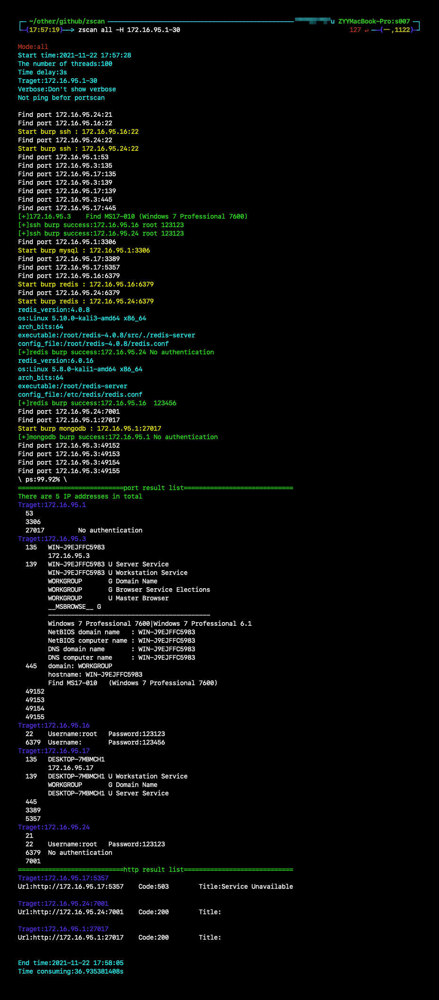

#              Zscan a scan blasting tool set
[](https://github.com/zyylhn/zscan/blob/master/LICENSE)
[](https://github.com/zyylhn/zscan/releases/tag/1.4.3)
[](https://github.com/zyylhn/zscan)

📄[English document](https://github.com/zyylhn/zscan/blob/master/README_EN.md)

更新内容见日志[log](https://github.com/zyylhn/zscan/blob/master/update.log)

<details>
<summary><b>结果输出格式</b></summary>
-输出的部分结果截图，分两个阶段，第一阶段是扫描过程中的输出，从主机存活探测结束开始，第二个阶段是将所有扫描的结果做整理，从输出port result list开始





</details>


## 简介🎉


​	Zscan是一个开源的内网端口扫描器、爆破工具和其他实用工具的集合体可以称为工具包。以内网网段发现、主机发现和端口扫描为基础，可以在blast模块中对mysql、mssql、redis、mongo、postgres、ftp、ssh、ldap、rdp、smb等服务进行爆破，在scan模块中进行netbios、smb、oxid、socks server（扫描代理服务器）、ms17010、http的poc扫描等扫描功能，默认会抓取http的title和指纹信息。在server模块中可以开启http（可以上传下载文件）和socks5服务器（代理服务器），tools模块中集成实用的小工具暂时只有nc。最新添加exploit模块，可以针对爆破成功的服务进行利用，可进行ssh交互式登陆（用户名密码或者密钥），redis主从复制和Lua沙箱逃逸（上传文件和执行命令），ldap查询（内置常见查询语句）。还有all模块，扫描的时候调用所有的扫描和爆破模块。支持ipv6扫描，支持域名输入并自动识别cdn。具体模块功能如下

工具体积较大，后期会出精简版，模块化设计，拆分掉不需要的功能很方便

```
  all         调用所有扫描和爆破模块
  ping        主机发现和网段发现
  ps          基本的端口扫描和http指纹识别title抓取
  scan        扫描模块
  		--->ms17010扫描
  		--->poc漏洞扫描（内置380个poc）
  		--->proxyfind内网代理服务器扫描
  		--->winscan Windows的smb，netbios和oxid扫描
  blast       爆破服务模块(包括以下爆破模块)
  		--->ftp
  		--->ldap
  		--->mongo
  		--->mssql
  		--->mysql
  		--->postgres
  		--->rdp
  		--->redis
  		--->smb
  		--->ssh
  server      start http server or socks5 server
  		--->http服务器（可上传下载文件）
  		--->socks5服务器（可启动一个代理服务器，支持身份验证）
  exploit     漏洞利用模块
  		--->ldap查询
  		--->redis组从复制上传文件执行命令，lua沙箱逃逸RCE
  		--->snmp查询
  		--->ssh登陆
  		--->sunlogin向日葵RCE
  tools   实用工具模块
  		--->nc简单的nc，可以开放端口连接端口
  		--->searchfile支持多线程正则搜索文件
```

使用格式为

```
zscan 模块 参数
```

```
 ______     ______     ______     ______     __   __    
/\___  \   /\  ___\   /\  ___\   /\  __ \   /\ "-.\ \   
\/_/  /__  \ \___  \  \ \ \____  \ \  __ \  \ \ \-.  \  
  /\_____\  \/\_____\  \ \_____\  \ \_\ \_\  \ \_\\"\_\ 
  \/_____/   \/_____/   \/_____/   \/_/\/_/   \/_/ \/_/

Usage:
  zscan [command]

Available Commands:
  all         Use all scan mode
  blast       Common service blasting
  exploit     sshlogin,redisexec
  help        Help about any command
  ping        ping scan to find computer
  ps          Port Scan
  scan        ms17010,proxyfind,snmp,winscan(smb,netbios,oxid),poc
  server      start http server or socks5 server

Flags:
  -h, --help            help for zscan
      --nobar           disable portscan progress bar
  -o, --output string   the path of result file (default "result.txt")
      --proxy string    Connect with a proxy(user:pass@172.16.95.1:1080 or 172.16.95.1:1080)
  -T, --thread thread   Set thread eg:2000 (default 600)
  -t, --timeout time    Set timeout(s) eg:5s (default 5s)
  -v, --verbose         Show verbose information


```
模块里面的Flag代表当前命令的参数，Global Flags代表全局参数（所有命令都可以用）
这里的Flags为全局参数，所有模块都可以使用

- --log：启用这个参数会将当前运行结果以追加的形式写到log.txt（可以记下每次运行的结果）
- -o --output：默认在当前目录的中文件名为Hosts -o指定路径
- --proxy ：设置代理，用户名密码（user:pass@ip:port）不需要省份验证（ip:port）
- -T --thread：指定线程数，默认100
- -t --timeout：设置延时，网络条件好追求速度的话可以设置成1s
- -v --verbose：设置显示扫描过程信息

## 功能模块😈

目前已有模块：

<details>
<summary><b>ping模块:普通用户权限调用系统ping，root权限可以选择使用icmp数据包</b></summary>

```
zscan ping 
```

```
Usage:
  zscan ping [flags]

Flags:
  -d, --discover string   Live network segment found,local parameter uses the local NIC information。eg:zscan ping -d local/zscan ping -d 172.18.0.0,172.19.0.0
  -h, --help              help for ping
  -H, --host hosts        Set hosts(The format is similar to Nmap)
      --hostfile string   Set host file
  -i, --icmp              Icmp packets are sent to check whether the host is alive(need root)

Global Flags:
      --nobar           disable portscan progress bar
  -o, --output string   the path of result file (default "result.txt")
      --proxy string    Connect with a proxy(user:pass@172.16.95.1:1080 or 172.16.95.1:1080)
  -T, --thread thread   Set thread eg:2000 (default 600)
  -t, --timeout time    Set timeout(s) eg:5s (default 5s)
  -v, --verbose         Show verbose information

```

必须指定host和hostfile两个参数其中的一个，当有root权限的时候可以使用-i不调用本地的ping而是自己发icmp数据包（线程开的特别高的话几千那种，调用本地ping命令会导致cpu占用过高）

--discover两种网段发现模式，一种是ping网络b段网关，一种是oxid扫描

--discover后面需要给一个参数，如果给local（zscan ping --disconver local）就会读取本地网卡信息，去扫描本地的网络b段，例如读取到本地的两张网卡192.168.13.13和172.16.95.23，那么他就会去ping192.168.0.0/16和172.16.0.0/16这两个b段

还可以给定一个或者多个b段ip例如172.17.0.0或者172.18.0.0,10.10.0.0，多个ip段用逗号隔开

</details>

<details>
<summary><b>ps模块:端口扫描和获取httptitle</b></summary>

```
zscan ps
```

```
Usage:
  zscan ps [flags]

Flags:
  -b, --banner            Return banner information
  -h, --help              help for ps
  -H, --host hosts        Set hosts(The format is similar to Nmap) eg:192.168.1.1/24,172.16.95.1-100,127.0.0.1
      --hostfile string   Set host file
  -i, --icmp              Icmp packets are sent to check whether the host is alive(need root)
      --noping            not ping discovery before port scanning
      --nowebscan         Whether to perform HTTP scanning (httpTitle and HTTP vulnerabilities)(default on)
  -p, --port port         Set port eg:1-1000,3306,3389 or use " zscan ps -p l" ) to scan less port（thirty port）
  -s, --syn               use syn scan
      --vulscan           Whether to perform HTTP vulnerabilities(default off)

Global Flags:
      --nobar           disable portscan progress bar
  -o, --output string   the path of result file (default "result.txt")
      --proxy string    Connect with a proxy(user:pass@172.16.95.1:1080 or 172.16.95.1:1080)
  -T, --thread thread   Set thread eg:2000 (default 600)
  -t, --timeout time    Set timeout(s) eg:5s (default 5s)
  -v, --verbose         Show verbose information

```

--host和--hostfile指定目标

-p指定端口，不指定的话使用默认端口，或者指定“l”使用less port（大概三十个常用端口）

--noping直接扫描所有目标不先ping

--icmp在使用ping的时候使用icmp包进行主机发现

--nowebscan 参数用来禁止开启web扫描只做端口扫描

--vulscan 参数用来开启poc探测（只有web扫描开启的时候才能使用，不然没有意义）

--syn 实用syn扫描（需要高权限）

</details>

<details>
<summary><b>all模块:调用所有扫描和爆破模块进行扫描</b></summary>

```
zscan all
```

```
Usage:
  zscan all [flags]

Flags:
  -h, --help              help for all
  -H, --host hosts        Set hosts(The format is similar to Nmap) eg:192.168.1.1/24,172.16.95.1-100,127.0.0.1
      --hostfile string   Set host file
  -i, --icmp              Icmp packets are sent to check whether the host is alive(need root)
      --noburp            Set postgres passworddict path
      --noping             Not ping before port scanning
      --novulscan         disable http vulnerability scan
      --passdict string   Set postgres passworddict path
  -P, --password string   Set postgres password
  -p, --port port         Set port eg:1-1000,3306,3389 or use " zscan all -p l" ) to scan less port（thirty port）
  -U, --username string   Set user name

Global Flags:
      --nobar           disable portscan progress bar
  -o, --output string   the path of result file (default "result.txt")
      --proxy string    Connect with a proxy(user:pass@172.16.95.1:1080 or 172.16.95.1:1080)
  -T, --thread thread   Set thread eg:2000 (default 600)
  -t, --timeout time    Set timeout(s) eg:5s (default 5s)
  -v, --verbose         Show verbose information

```

all模块本质是和ps模块基本相同，只不过all模块扫到对应的端口的时候会在当前线程中进行指纹识别或者用户名密码爆破

all模块参数和ps模块相同，就多了一个密码字典，是用来设置扫到需要爆破的端口时候的字典，其他都一样

--notburp 不进行爆破只进行扫描

--novulscan 由于all模块会调用所有模块，这个参数用于禁止漏洞扫描

</details>

<details>
<summary><b>blast:爆破模块，包括常见服务的爆破功能</b></summary>

```
zscan blast
```

```
Usage:
  zscan blast [command]

Available Commands:
  ftp         burp ftp username and password 
  ldap        burp ldap username and password
  mongo       burp mongodb username and password
  mssql       burp mssql username and password
  mysql       burp mysql username and password
  postgres    burp postgres username and password
  rdp         burp remote desktop（3389）
  redis       burp redis password
  smb         burp smb usernamae and password
  ssh         burp ssh username password or traverse the key

Flags:
  -h, --help   help for blast

Global Flags:
      --nobar           disable portscan progress bar
  -o, --output string   the path of result file (default "result.txt")
      --proxy string    Connect with a proxy(user:pass@172.16.95.1:1080 or 172.16.95.1:1080)
  -T, --thread thread   Set thread eg:2000 (default 600)
  -t, --timeout time    Set timeout(s) eg:5s (default 5s)
  -v, --verbose         Show verbose information
```

基本上所有的爆破模块使用方式都相同，指定用户名密码或者用户名密码字典即可，还可以指定爆破线程，这个线程和-T的线程不同，-T的线程代表我们并发扫描的目标数量（这个目标是ip和端口的组合，每次并发相当于对目标发送了一个数据包），burptheard代表当我们在上面的并发扫描的单个线程中发现了我们的目标端口例如mysql，他会在当前的扫描线程中开启一个多线程爆破（这里的目标换成了特定ip特定的一个端口，这里就需要进行限速，速度太快可能导致目标服务不可用）

</details>

<details>
<summary><b>scan模块:常见的扫描模块</b></summary>

```
Usage:
  zscan scan [command]

Available Commands:
  ms17010     MS17_010 scan
  poc         poc check
  proxyfind   Scan proxy
  snmp        snmp scan
  winscan     netbios、smb、oxid scan

Flags:
  -h, --help   help for scan

Global Flags:
      --nobar           disable portscan progress bar
  -o, --output string   the path of result file (default "result.txt")
      --proxy string    Connect with a proxy(user:pass@172.16.95.1:1080 or 172.16.95.1:1080)
  -T, --thread thread   Set thread eg:2000 (default 600)
  -t, --timeout time    Set timeout(s) eg:5s (default 5s)
  -v, --verbose         Show verbose information


```


<details>
<summary><b>proxyfind模块:扫描网络中的代理，目前支持socks4/5，后期添加http</b></summary>

```
zscan scan proxyfind
```

```
Usage:
  zscan proxyfind [flags]

Flags:
  -h, --help              help for proxyfind
  -H, --host hosts        Set hosts(The format is similar to Nmap) eg:192.168.1.1/24,172.16.95.1-100,127.0.0.1
      --hostfile string   Set host file
  -p, --ports port        Set port eg:1-1000,3306,3389 (default "1080,1089,8080,7890,10808")
      --type string       Set the scan proxy type(socks4/socks5/http) (default "socks5")

Global Flags:
      --log             Record the scan results in chronological order，Save path./log.txt
  -O, --output          Whether to enter the results into a file（default ./result.txt),can use --path set
      --path string     the path of result file (default "result.txt")
  -T, --thread thread   Set thread eg:2000 (default 100)
  -t, --timeout time    Set timeout(s) eg:5s (default 3s)
  -v, --verbose         Show verbose information
```

扫描内网中的代理服务器

-H 指定目标，-p指定端口，--type指定扫描的代理协议类型（目前支持socks4/5，其他协议还在努力中）
</details>

<details>
<summary><b>ms17010模块:ms17010漏洞批量扫描</b></summary>

```
Usage:
  zscan scan ms17010 [flags]

Flags:
  -h, --help              help for ms17010
  -H, --host string       Set target
      --hostfile string   Set host file

Global Flags:
      --log             Record the scan results in chronological order，Save path./log.txt
  -O, --output          Whether to enter the results into a file（default ./result.txt),can use --path set
      --path string     the path of result file (default "result.txt")
  -T, --thread thread   Set thread eg:2000 (default 100)
  -t, --timeout time    Set timeout(s) eg:5s (default 3s)
  -v, --verbose         Show verbose information
```

只需要指定目标即可
</details>


<details>
<summary><b>winscan模块:包含oxid，smb，netbios扫描功能</b></summary>

```
Usage:
  zscan scan winscan [flags]

Flags:
  -h, --help              help for winscan
  -H, --host string       Set target
      --hostfile string   Set host file
      --netbios           netbios scan
      --oxid              oxid scan
      --smb               smb scan

Global Flags:
      --log             Record the scan results in chronological order，Save path./log.txt
  -O, --output          Whether to enter the results into a file（default ./result.txt),can use --path set
      --path string     the path of result file (default "result.txt")
  -T, --thread thread   Set thread eg:2000 (default 100)
  -t, --timeout time    Set timeout(s) eg:5s (default 3s)
  -v, --verbose         Show verbose information
```

如果直接给目标的话会同时扫描netbios，oxid，smb。可以使用--来指定只使用某一个

</details>

<details>
<summary><b>poc模块:既是一个单独模块也是一个功能在其他模块调用</b></summary>

```
poc check

Usage:
  zscan scan poc [flags]

Flags:
  -h, --help             help for poc
  -l, --listpoc          List built in poc
      --pocname string   set the poc name
      --pocpath string   set target url
      --pocthread int    set poc scan thread (default 500)
  -u, --url string       set target url
      --urlfile string   set target file

Global Flags:
      --nobar           disable portscan progress bar
  -o, --output string   the path of result file (default "result.txt")
      --proxy string    Connect with a proxy(user:pass@172.16.95.1:1080 or 172.16.95.1:1080)
  -T, --thread thread   Set thread eg:2000 (default 600)
  -t, --timeout time    Set timeout(s) eg:5s (default 5s)
  -v, --verbose         Show verbose information
```


-l/--list：列出工具内置的poc

--pocname：其实是一个筛选选项，他会筛选出poc名字中包含指定字段的poc（扫描和查看都可用）

--pocpth：指定目录的话就会使用该目录下所有poc，指定poc的话就会只使用这个poc

--pocthread：poc扫描的线程

--url/--urlfile：指定目标，-u/--url指定单个，可以通过指定txt批量扫描

</details>

</details>

<details>
<summary><b>server模块:开启服务器模块</b></summary>

```
Usage:
  zscan server [command]

Available Commands:
  httpserver  Start an authentication HTTP server
  socks5      Create a socks5 server

Flags:
  -h, --help   help for server

Global Flags:
      --nobar           disable portscan progress bar
  -o, --output string   the path of result file (default "result.txt")
      --proxy string    Connect with a proxy(user:pass@172.16.95.1:1080 or 172.16.95.1:1080)
  -T, --thread thread   Set thread eg:2000 (default 600)
  -t, --timeout time    Set timeout(s) eg:5s (default 5s)
  -v, --verbose         Show verbose information

```


<details>
<summary><b>socks5模块:开启一个socks5的服务器</b></summary>
```
zscan socks5
```

```
Usage:
  zscan server socks5 [flags]

Flags:
  -a, --addr string       Specify the IP address and port of the Socks5 service (default "0.0.0.0:1080")
  -h, --help              help for socks5
  -P, --password string   Set the socks5 service authentication password
  -U, --username string   Set the socks5 service authentication user name

Global Flags:
      --log             Record the scan results in chronological order，Save path./log.txt
  -O, --output          Whether to enter the results into a file（default ./result.txt),can use --path set
      --path string     the path of result file (default "result.txt")
  -T, --thread thread   Set thread eg:2000 (default 100)
  -t, --timeout time    Set timeout(s) eg:5s (default 3s)
  -v, --verbose         Show verbose information
```

可以使用-a指定socks5服务监听的ip和端口

-p和-u指定代理的用户名和密码

</details>

<details>
<summary><b>httpserver模块:开启一个http服务器，支持身份认证和文件上传</b></summary>

```
Usage:
 zscan server httpserver [flags]

Flags:
  -a, --addr string   set http server addr (default "0.0.0.0:7001")
  -d, --dir string    set HTTP server root directory (default ".")
  -h, --help          help for httpserver
  -P, --pass string   Set the authentication password
  -U, --user string   Set the authentication user

Global Flags:
      --log             Record the scan results in chronological order，Save path./log.txt
  -O, --output          Whether to enter the results into a file（default ./result.txt),can use --path set
      --path string     the path of result file (default "result.txt")
  -T, --thread thread   Set thread eg:2000 (default 100)
  -t, --timeout time    Set timeout(s) eg:5s (default 3s)
  -v, --verbose         Show verbose information
```


开一个简单的http服务器，能下载文件和上传文件，上传文件需要使用-u参数

-a指定监听的ip和地址

-d指定httpserver开启的根目录

-P和-U设置身份验证的用户名密码
</details>

</details>

<details>
<summary><b>tools模块:集成了常用的工具</b></summary>

```
Usage:
  zscan tools [command]

Available Commands:
  nc          A easy nc

Flags:
  -h, --help   help for tools

Global Flags:
      --nobar           disable portscan progress bar
  -o, --output string   the path of result file (default "result.txt")
      --proxy string    Connect with a proxy(user:pass@172.16.95.1:1080 or 172.16.95.1:1080)
  -T, --thread thread   Set thread eg:2000 (default 600)
  -t, --timeout time    Set timeout(s) eg:5s (default 5s)
  -v, --verbose         Show verbose information
```


<details>
<summary><b>nc模块:一个简单的nc，可以开端口连接端口</b></summary>

```
zscan nc
```

```
Usage:
  zscan nc [flags]

Flags:
  -a, --addr string   listen/connect host address eg(listen):-a 0.0.0.0:4444  eg(connect):-a 172.16.95.1:4444
  -h, --help          help for nc
  -l, --listen        listen mode(default connect)

Global Flags:
      --log             Record the scan results in chronological order，Save path./log.txt
  -O, --output          Whether to enter the results into a file（default ./result.txt),can use --path set
      --path string     the path of result file (default "result.txt")
  -T, --thread thread   Set thread eg:2000 (default 100)
  -t, --timeout time    Set timeout(s) eg:5s (default 3s)
  -v, --verbose         Show verbose information

-a指定地址，不使用-l的话代表连接目标，使用-l为监听端口
```

</details>

<details>
<summary><b>searchfile模块:多线程搜索文件，并支持正则</b></summary>

```
Search files that support regular matching

Usage:
  zscan tools searchfile [flags]

Flags:
  -d, --dir string           set search base Dir
  -f, --file stringArray     set filename eg:zscan tools searchfile -d ./ -f pass.txt -f user.txt
  -h, --help                 help for searchfile
  -r, --regexp stringArray   Specifies the re matching parameters
      --walk int             Traversal turns on multithreading depth(Try not to go above 5) (default 3)

Global Flags:
      --nobar           disable portscan progress bar
  -o, --output string   the path of result file (default "result.txt")
      --proxy string    Connect with a proxy(user:pass@172.16.95.1:1080 or 172.16.95.1:1080)
  -T, --thread thread   Set thread eg:2000 (default 600)
  -t, --timeout time    Set timeout(s) eg:5s (default 5s)
  -v, --verbose         Show verbose information
```

-d指定搜索的根目录，linux可以使用相对路径，winsows上需要绝对路径

-f指定要搜索的文件名，可以使用-f 文件名1 -f 文件名2 来搜索多个文件

-r是使用正则，其实本质上-f也是使用正则只不过给替换成`^文件名$`

--walk是指遍历开启线程的目录深度：逻辑上是在给定的目录下面遍历有多少文件夹，然后开启多少线程去遍历这些子文件夹，所有这个深度不要太高，虽然越深越快，但是会导致cpu利用过高（三层其实就已经会占用很高了，所以特殊场景建议使用1）

</details>

</details>

<details>
<summary><b>exploit模块:服务爆破成功之后的利用模块</b></summary>

```
Usage:
  zscan exploit [command]

Available Commands:
  ldap        Ldap queries
  redis       Redis utilizes modules
  snmp        snmp scan
  sshlogin    Login using a user name, password, or key
  sunlogin    sunlogin RCE CNVD-2022-10270

Flags:
  -h, --help   help for exploit

Global Flags:
      --nobar           disable portscan progress bar
  -o, --output string   the path of result file (default "result.txt")
      --proxy string    Connect with a proxy(user:pass@172.16.95.1:1080 or 172.16.95.1:1080)
  -T, --thread thread   Set thread eg:2000 (default 600)
  -t, --timeout time    Set timeout(s) eg:5s (default 5s)
  -v, --verbose         Show verbose information
```


<details>
<summary><b>snmp模块:snmp扫描</b></summary>

```
Usage:
  zscan exploit snmp [flags]
```

```
Flags:
      --burpthread int        Set burp password thread(recommend not to change) (default 100)
      --get string            set an oid
  -h, --help                  help for snmp
  -H, --host string           Set target
      --hostfile string       Set host file
  -l, --listoid               List commonly used OIDs
      --password string       set a password (default "public")
      --passwordfile string   passwords dict file, eg: ./dict/password.txt
  -p, --port port             Set port (default 161)
      --version string        specifies SNMP version to use. 1|2c|3  (default "2c")
      --walk string           set an oid

Global Flags:
      --log             Record the scan results in chronological order，Save path./log.txt
  -O, --output          Whether to enter the results into a file（default ./result.txt),can use --path set
      --path string     the path of result file (default "result.txt")
  -T, --thread thread   Set thread eg:2000 (default 100)
  -t, --timeout time    Set timeout(s) eg:5s (default 3s)
  -v, --verbose         Show verbose information
```

--listoid列出常见的查询信息

```
0: 系统基本信息         SysDesc                 GET     1.3.6.1.2.1.1.1.0
1: 监控时间             sysUptime               GET     1.3.6.1.2.1.1.3.0
2: 系统联系人           sysContact              GET     1.3.6.1.2.1.1.4.0
3: 获取机器名           SysName                 GET     1.3.6.1.2.1.1.5.0
4: 机器所在位置         SysLocation             GET     1.3.6.1.2.1.1.6.0
5: 机器提供的服务       SysService              GET     1.3.6.1.2.1.1.7.0
6: 系统运行的进程列表   hrSWRunName             WALK    1.3.6.1.2.1.25.4.2.1.2
7: 系统安装的软件列表   hrSWInstalledName       WALK    1.3.6.1.2.1.25.6.3.1.2
8: 网络接口列表         ipAdEntAddr             WALK    1.3.6.1.2.1.4.20.1.1
```


可以通过使用--walk和--get进行查询

密码不指定的话默认使用public

</details>

<details>
<summary><b>sshlogin:可进行ssh账号密码和密钥登陆</b></summary>

```
Usage:
  zscan exploit sshlogin [flags]

Flags:
  -h, --help              help for sshlogin
  -H, --host string       Set ssh server host
  -d, --keypath string    Set public key path
  -k, --login_key         Use public key login
  -P, --password string   Set ssh password
  -p, --port int          Set ssh server port (default 22)
  -U, --username string   Set ssh username

Global Flags:
      --nobar           disable portscan progress bar
  -o, --output string   the path of result file (default "result.txt")
      --proxy string    Connect with a proxy(user:pass@172.16.95.1:1080 or 172.16.95.1:1080)
  -T, --thread thread   Set thread eg:2000 (default 600)
  -t, --timeout time    Set timeout(s) eg:5s (default 5s)
  -v, --verbose         Show verbose information
```

​	账号密码登陆：./zscan exploit ssh -H 172.16.95.24 -U root -P 123456

​	公钥登陆：./zscan exploit ssh -H 172.16.95.24 -U root -k 

​	公钥登陆默认会去当前用户目录下面的./ssh取私钥，可以使用-d/--keypath指定私钥路径

</details>

<details>
<summary><b>redis:redis利用模块</b></summary>

```
Usage:
  zscan exploit redis [flags]

Flags:
  -c, --command string    Set the command you want to execute eg:(zscan exploit redis -H 172.16.95.16 -P 123456 -c "keys *")
      --dstpath string    set target path
      --exec              use execute the command mode
  -h, --help              help for redis
  -H, --host string       Set redis server host
      --lhost string      set listen host(!!!Make sure the target has access!!!)
      --lport int         set listen port(!!!Make sure the target has access!!!) (default 20001)
      --lua               use CVE-2022-0543 to attack
  -P, --password string   Set redis password
  -p, --port int          Set redis server port (default 6379)
      --so string         set .so file path
      --srcpath string    set upload file path
      --upload            use upload mode

Global Flags:
      --nobar           disable portscan progress bar
  -o, --output string   the path of result file (default "result.txt")
      --proxy string    Connect with a proxy(user:pass@172.16.95.1:1080 or 172.16.95.1:1080)
  -T, --thread thread   Set thread eg:2000 (default 600)
  -t, --timeout time    Set timeout(s) eg:5s (default 5s)
  -v, --verbose         Show verbose information
```

-c用来执行普通的redis命令模式

--exec：使用主从复制执行命令模式

--upload：使用主从复制的上传文件模式

--lua：使用lua沙箱逃逸漏洞模式

以上四个参数必须需要其中一个

--detpath：用来指定主从复制将文件上传到目标的绝对路径

--lport：主从复制时主节点（也就是zscan）监听的端口，默认20001

--lhost:主从复制时主节点（也就是zscan）监听的地址，必须要保证目标redis能访问到

--so:主从复制执行命令的时候上传到目标上的so文件

--srcpath:主从复制上传文件的源文件

</details>

<details>
<summary><b>sunlogin模块:向日葵RCE的利用模块</b></summary>

```
sunlogin RCE CNVD-2022-10270

Usage:
  zscan exploit sunlogin [flags]

Flags:
  -c, --command string   command you want to execute
  -h, --help             help for sunlogin
  -H, --host string      Set redis server host
  -p, --port int         Set RCE port

Global Flags:
      --nobar           disable portscan progress bar
  -o, --output string   the path of result file (default "result.txt")
      --proxy string    Connect with a proxy(user:pass@172.16.95.1:1080 or 172.16.95.1:1080)
  -T, --thread thread   Set thread eg:2000 (default 600)
  -t, --timeout time    Set timeout(s) eg:5s (default 5s)
  -v, --verbose         Show verbose information
```

漏洞发现可以使用ps模块或者all模块对40000-65535进行扫描，可以自动识别出漏洞端口

可以使用-c执行一条命令，不使用-c进入交互式（伪交互式）按照输入执行命令

-p指定端口

</details>

</details>

## 使用示例🤪

<details>
<summary><b>ping网段发现:zscan ping --discover local</b></summary>

```
zscan ping --discover local或者
zscan ping --discover 192.168.0.0
```




</details>

<details>
<summary><b>ps端口扫描:zscan ps -H ip</b></summary>

```
zscan ps -H 172.16.95.1-30 [--noping禁用ping]
zscan ps -H 172.16.95.1-30 --vulsacn  //扫描完http banner之后进行poc探测
zscan ps -H 172.16.95.1-30 --nowebscan   //只扫描端口，不进行http探测
```




</details>

<details>
<summary><b>ssh模块爆破/登录 </b></summary>

```
爆破 zscan blast ssh -H 172.16.95.24
登录 zscan exploit ssh -H 172.16.95.24 -U root -P 123123
```


</details>

<details>
<summary><b>redis模块爆破/执行命令</b></summary>

```
爆破 zscan blast redis -H 172.16.95.1-30
登录 zscan exploit redis -H 172.16.95.16 -c cmd
```





</details>

<details>
<summary><b>winscan模块:zscan scan winscan -H ip</b></summary>

```
zscan scan winscan -H 172.16.95.1-33
```



</details>

<details>
<summary><b>调用所有扫描爆破模块:zscan all -H ip</b></summary>

```
zscan all -H 172.16.95.1-30
zscan all -H 172.16.95.1-30 --novulscan //不进行poc探测
```



</details>

<details>
<summary><b>poc扫描模块:zscan scan poc -u url</b></summary>

```
zscan scan poc -l //列出所有内置poc
zscan scan poc -l --pocname weblogic   //列出内置和weblogic有关的poc
zscan scan poc -u http://172.16.95.24:8080 //使用所有内置poc扫描目标
zscan scan poc -u http://172.16.95.24:8080 --pocname weblogic  //只使用weblogic的poc
zscan scan poc -U http://172.16.95.24:8080 --pocpath /root/pocs   //使用整个pocs目录下的poc
zscan scan poc --urlfile url.txt --pocpath /root/pocs/weblogic.yml  //使用单个poc批量扫描目标
```

</details>

## 工具优势🚀

- 命令简单方便，模块功能调用简洁明了，方便拓展添加各种新功能，也方便删除不需要的模块
- 独特的网段发现功能，大家有更好的发现方式可以告诉我，给加上😜
- 不仅仅是一个扫描器，还集成各种常见的实用功能，内置代理功能（由于数据库驱动没有提供接口，导致msssql、mongo、postgres爆破和执行命令走不了代理，如果有师傅知道的话可以与我联系），可以称为工具包。
- 端口扫描和爆破无缝衔接，大幅提升扫描速度：这个优势在all模块中被体现的淋漓尽致，在端口多线程扫描的过程中会判断开放端口，如果端口可进行爆破会立即在当前的线程再中开启一个多线程进行爆破。大幅提升速度。减少了中间先获取开放端口在进行爆破的步骤
- 美观易读的输出格式：通过颜色区分，不仅仅在过程中进行输出，还会在扫描结束生成扫描结果，将过程中所有扫描和爆破的结果展示出来（[简介上方的输出格式](https://github.com/zyylhn/zscan#简介)），并且支持讲扫描结果记录到文件
- 对服务不仅仅能爆破，爆破成功还可以执行命令，后期还会加上一键利用功能
- 正在开发中，各位师傅如果发现什么问题bug，或者有什么新奇有趣的功能需求可与我联系

## 源码编译👨

建议自己编译，relese有时候可能没有更新,由于某种原因，现在不提供编译好的zscan，编译命令在下面自取

```
go get github.com/zyylhn/zscan
go bulid
或者docker编译
docker pull golang
docker run -v "$GOPATH":/go -v "$PWD":/go/src/zscan -w /go/src/zscan -e GOOS="darwin" -e GOARC    H="amd64" golang go build -v -ldflags="-s -w" -trimpath -o zscan_mac_x64
docker run -v "$GOPATH":/go -v "$PWD":/go/src/zscan -w /go/src/zscan -e GOOS="windows" -e GOAR    CH="amd64" golang go build -v -ldflags="-s -w" -trimpath -o zscan_x64.exe
docker run -v "$GOPATH":/go -v "$PWD":/go/src/zscan -w /go/src/zscan -e GOOS="linux" -e GOARCH    ="amd64" golang go build -v -ldflags="-s -w" -trimpath -o zscan_linux_x64
```

## 免责声明🧐

本工具仅面向**合法授权**的企业安全建设行为，如您需要测试本工具的可用性，请自行搭建靶机环境。

在使用本工具进行检测时，您应确保该行为符合当地的法律法规，并且已经取得了足够的授权。**请勿对非授权目标进行扫描。**

如您在使用本工具的过程中存在任何非法行为，您需自行承担相应后果，我们将不承担任何法律及连带责任。

在安装并使用本工具前，请您**务必审慎阅读、充分理解各条款内容**，限制、免责条款或者其他涉及您重大权益的条款可能会以加粗、加下划线等形式提示您重点注意。 除非您已充分阅读、完全理解并接受本协议所有条款，否则，请您不要安装并使用本工具。您的使用行为或者您以其他任何明示或者默示方式表示接受本协议的，即视为您已阅读并同意本协议的约束。

## 参考链接👀

https://github.com/shadow1ng/fscan

https://github.com/k8gege/LadonGo

## 更新进度💪

### 功能模块

- [x] ping模块：ping主机发现
  - [x] 调用系统ping
  - [x] 发送icmp数据包
  - [x] 内网网段发现
    - [x] ping网段b段网关
    - [x] oxid扫描
- [x] ps端口扫描模块
  - [x] 获取http title和状态吗
  - [x] http指纹是被
  - [x] http poc验证
  - [x] 返回banner信息
  - [x] 先ping再扫
- [x] all模块调用所有模块
- [x] blast模块
    - [x] ssh模块
    - [x] ftp模块
    - [x] mysql模块
    - [x] mssql
    - [x] mongo模块
    - [x] redis模块
    - [x] postgres模块
    - [x] ldap
    - [x] smb
    - [x] rdp
- [x] scan模块
    - [x] 扫描代理服务器模块
        - [x] socks5代理服务器扫描
    - [x] winscan模块@https://github.com/shenzhibuqins
        - [x] smb扫描功能
        - [x] oxid扫描功能
        - [x] netbios扫描功能
    - [x] 17010扫描模块
    - [x] poc
        - [x] 支持xray v1
        - [ ] 支持xray v2

- [x] server模块
  - [x] socks服务器模块
    - [x] 用户名密码认证
  - [x] 开启http服务器模块
      - [x] 身份认证功能
      - [x] 文件上传功能

- [x] tool模块
    - [x] nc模块
        - [x] 监听端口功能
        - [x] 连接端口功能

    - [x] 搜索文件功能
        - [x] 同时搜索多个文件，多线程
        - [x] 正则搜索
        - [ ] 搜索文件内容
    - [ ] 打包文件夹功能

- [x] exploit模块
    - [x] sshloin模块
        - [x] 用户名密码登录功能（交互式）
        - [x] 密钥登录功能（交互式）
    - [x] redis模块
        - [x] 执行redis密令
        - [x] lua沙箱逃逸漏洞
        - [x] 主从复制rce
    - [x] ladp查询
    - [ ] snmp查询
    - [ ] wmi模块

- [ ] ..........

### 工具本身功能

- [x] 输出结果到文件
- [x] 记录每次运行结果的log功能
- [x] 设置线程功能（扫描支持超高线程）
- [x] 设置timeout功能
- [x] 代理功能
	- [ ] udp协议代理功能
	- [x] tcp协议代理功能
	- [x] 服务爆破和执行命令代理功能
		- [x] mysql
		- [ ] mssql
		- [x] redis
		- [x] mongodb
		- [ ] postgres
		- [x] ssh
		- [x] ftp
- [x] 从文件读取目标功能
- [x] 爆破支持超大字典
- [ ] ...........

### 后期目标

- [ ] 完善当前版本各服务器爆破模块，支持更多的命令，尽量达到无障碍命令使用，并添加数据库利用模块（爆破成功数据库之后的利用）
  - [ ] Mysql
  - [ ] Mssql
  - [ ] Postgres
  - [ ] Mongodb
  - [ ] Ftp
- [ ] 出精简版的zscna
  - [ ] 去掉所有数据库的驱动以减少体积，代价是不能执行命令
  - [ ] 去掉不常用的数据库模块，或者没用的数据库模块

感谢老铁的星星🥳

欢迎提问题👏

欢迎分享web指纹和poc

喜欢用go写工具的同学可以加入我们super_yu@yeah.net😃

